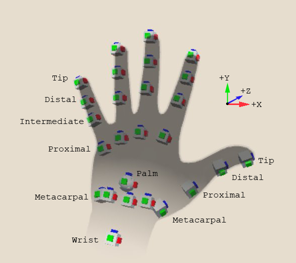

## Hand data model

Hand tracking provides data such as position, orientation, and velocity for several points on a user's hand. The following diagram illustrates the tracked points:

 *Left hand showing tracked hand points*

The tracked points of the hand correspond to the anatomical joints, which are labeled after the bone closest to the tip, and also the fingertips, the wrist and the palm. Note that the thumb has one fewer joint than the other fingers because thumbs do not have an intermediate phalanx.

The hand API reports tracking data relative to the real-world location chosen by the user's device as its tracking origin. Distances are provided in meters. The [XR Origin](https://docs.unity3d.com/Packages/com.unity.xr.core-utils@2.2/manual/xr-origin.html) in a properly configured XR scene is positioned relative to the device's tracking origin. To position model hands in the correct place in a virtual scene relative to the user's real hands, you can set the local poses of a hand model in your scene directly from the tracking data as long as the model is a child of the XR Origin's [Camera Offset](https://docs.unity3d.com/Packages/com.unity.xr.core-utils@2.2/manual/xr-origin-reference.html) object in the scene hierarchy. In other situations, you can transform the hand data into Unity world space with the XR Origin's pose.

> [!Note]
> Unity uses a left hand coordinate system, with the positive Z axis facing forward. This is different from the right-handed coordinate system used by OpenXR. Provider plug-in implementations are required to transform the data they provide into the Unity coordinate system. 

The tracking data supplied by the hand API includes:

| Name| API | Description |
|:---|:---|:---| 
| Hand pose| [XRHand.rootPose](xref:UnityEngine.XR.Hands.XRHand.rootPose*) | The position and rotation of a hand. Positions are in meters and the rotation is expressed as a quaternion. |
| Joint pose| [XRHandJoint.TryGetPose](xref:UnityEngine.XR.Hands.XRHandJoint.TryGetPose(UnityEngine.Pose@)) | The position and rotation of a joint.  Note that the term "joint" should be interpreted loosely in this context. The list of joints provided by the XRHand includes the fingertips and the palm. |
| Joint radius| [XRHandJoint.TryGetRadius](xref:UnityEngine.XR.Hands.XRHandJoint.TryGetRadius*) | The distance from the center of the joint to the skin surface. |
| Joint linear velocity| [XRHandJoint.TryGetLinearVelocity](xref:UnityEngine.XR.Hands.XRHandJoint.TryGetLinearVelocity*) | A vector expressing the speed and direction of the joint in meters per second. |
| Joint angular velocity| [XRHandJoint.TryGetAngularVelocity](xref:UnityEngine.XR.Hands.XRHandJoint.TryGetAngularVelocity*) | A vector expressing a joint's rotational velocity. The direction of this vector is the axis of rotation and its magnitude is the angular velocity in meters per second. |
| Grip| [XRHandDevice.gripPosition](xref:UnityEngine.XR.Hands.XRHandDevice.gripPosition*) [XRHandDevice.gripRotation](xref:UnityEngine.XR.Hands.XRHandDevice.gripRotation*) | The position and orientation of the center of mass of a hand in a grip pose. |
| Pinch| [XRHandDevice.pinchPosition](xref:UnityEngine.XR.Hands.XRHandDevice.pinchPosition) [XRHandDevice.pinchRotation](xref:UnityEngine.XR.Hands.XRHandDevice.pinchRotation) | The position and orientation of the point between the thumb and the index finger when the hand is in a pinching pose. |
| Poke| [XRHandDevice.pokePosition](xref:UnityEngine.XR.Hands.XRHandDevice.pokePosition) [XRHandDevice.pokeRotation](xref:UnityEngine.XR.Hands.XRHandDevice.pokeRotation) | The position and orientation of the index fingertip when the hand is in a poking pose. |
| Device gestures, including pinch, menu pressed, and system.| [MetaAimHand.aimFlags](xref:UnityEngine.XR.Hands.OpenXR.MetaHandTrackingAim.MetaAimHand.aimFlags*) | Hand gestures reported through the Meta Aim Hand extension to OpenXR. |
| Aim direction and position| [MetaAimHand.devicePosition](xref:UnityEngine.InputSystem.TrackedDevice.devicePosition) [MetaAimHand.deviceRotation](xref:UnityEngine.InputSystem.TrackedDevice.deviceRotation) | A pose indicating where a device gesture is pointing, which can be used for UI and other interactions in a scene. |

The [XRHand](xref:UnityEngine.XR.Hands.XRHand), [XRHandJoint](xref:UnityEngine.XR.Hands.XRHandJoint), and [XRHandDevice](xref:UnityEngine.XR.Hands.XRHandDevice) objects are always available from a provider plug-in that supports the [XRHandSubsystem](xref:UnityEngine.XR.Hands.XRHandSubsystem). However, a provider might not support every possible joint on the hand. You can determine which joints the current device supports with the [XRHandSubsystem.jointsInLayout](xref:UnityEngine.XR.Hands.XRHandSubsystem.jointsInLayout) property. Refer to [Get provider data layout](xref:xrhands-access-data#joint-layout) for more information. 

A provider might not support every type of data for a hand or joint, or might not be able to provide it with every hand update event. In both cases, you can determine which data are valid in an update with the  [XRHandJoint.trackingState](xref:UnityEngine.XR.Hands.XRHandJoint.trackingState) property. Refer to [Check data validity](xref:xrhands-access-data#check-data-validity) for more information.

The data for the [MetaAimHand](xref:UnityEngine.XR.Hands.MetaAimHand) is supplied by an optional OpenXR extension. Provider plug-ins are not required to support it. Use the [MetaAimHand.aimFlags](xref:UnityEngine.XR.Hands.MetaAimHand.aimFlags) at runtime to determine if the data in a `MetaAimHand` object is valid. 
