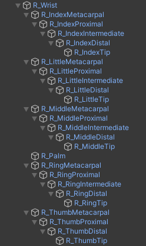

# XR Hand Skeleton Driver

The [XRHandSkeletonDriver](xref:UnityEngine.XR.Hands.XRHandSkeletonDriver) component manages the Transform components of each joint in the hand skeleton.
The component subscribes to events from a [XRHandTrackingEvents](xref:UnityEngine.XR.Hands.XRHandTrackingEvents) component and updates the joint transforms when the joints and root pose are updated.

To set up the joints for a standard hand skeleton, you can assign the Root Transform and then select the **Find Joints** button in the Inspector window to automatically find the joints in the hierarchy.
The Find Joints button will use the name of the child GameObjects of the Root Transform and match the joint name with the end of the GameObject name

 *The standard hierarchy of named joints in a right hand skeleton.*

The skeleton driver will work for any hierarchy of joints that matches the following structure:
- The top joint is the `Wrist`
- The direct child GameObjects of the `Wrist` contains the `Palm`, and the first joint of all fingers.
- The `Index`, `Middle`, `Ring`, and `Little` fingers each have a chain of successive joints for `Metacarpal`, `Proximal`, `Intermediate`, `Distal`, and `Tip`.
- The `Thumb` finger has the same joints as the other fingers except it has no `Intermediate` joint.

The parent structure is important to the skeleton driver because the pose for each joint is relative to the parent joint.

Not every joint is required to be included, but if a joint is included, it should also include all its parents. 
For example, you can ignore an entire finger by not including the `Metacarpal` joint and its child GameObjects, but if you include the `Proximal` joint, you must also include the `Metacarpal` joint as its parent.

# XR Hand Mesh Controller

The [XRHandMeshController](xref:UnityEngine.XR.Hands.XRHandMeshController) component subscribes to events from a [XRHandTrackingEvents](xref:UnityEngine.XR.Hands.XRHandTrackingEvents) component and can enable and disable a Mesh Renderer component for the hand when tracking is acquired and lost.
