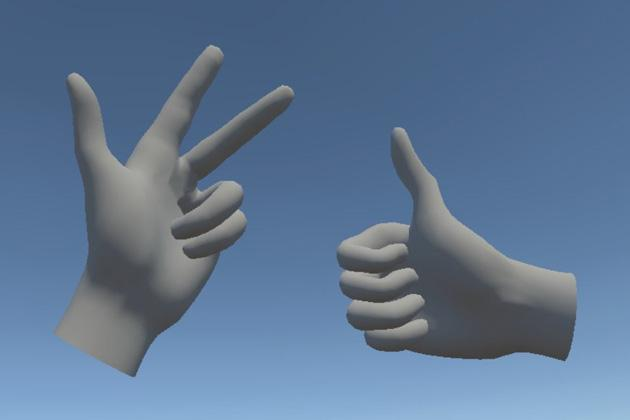
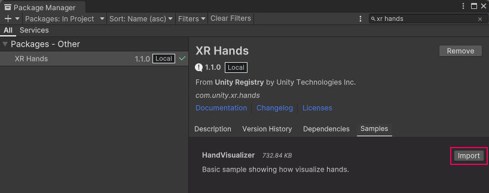

# XR Hands

The XR Hands package defines an API that allows you to access hand tracking data from devices that support hand tracking. To access hand tracking data, you must also enable a provider plug-in that implements the XR hand tracking subsystem.

 *Hand-tracking*

The XR Hand package provides:

* [XRHandSubsystem](xref:UnityEngine.XR.Hands.XRHandSubsystem): defines the XR subsystem interface for hand  tracking data.
* [OpenXR HandTracking feature](xref:xrhands-openxr-hands-feature): this feature implements the `XRHandSubsystem` for the OpenXR provider plug-in. This means that you can access hand data if you have both the OpenXR and this XR Hand packages installed in a project. Other provider plug-ins must be updated to implement the XRHandSubsystem before you can access hand data when using them.
* [Open XR Meta Aim Hand feature](xref:xrhands-meta-aim-feature): this feature provides data from the XR_FB_hand_tracking_aim  extension to the OpenXR specification. This extension provides basic gesture recognition. 
* [XRHand struct](xref:UnityEngine.XR.Hands.XRHand): the data for an individual tracked hand.
* [XRHandJoint struct](xref:UnityEngine.XR.Hands.XRHandJoint): the data for an individual joint or other tracked point of the hand.
* [MetaAimHand class](xref:UnityEngine.XR.Hands.MetaAimHand): the pinch and aim gesture data from the Meta Aim hand OpenXR feature.

Refer to [Hand tracking data](xref:xrhands-tracking-data) for more information about using hand data in an application.

> [!NOTE]
> If you are implementing hand tracking for a Unity provider plug-in, see [Implement a provider](xref:xrhands-implement-a-provider). If you are intercepting hand tracking data to filter or process it before it's reported to the caller, see [Process joints](xref:xrhands-process-joints).

## Supporting packages

The XR Hands package defines the API for hand tracking, but doesn't implement the feature itself. To use hand tracking on a target platform, you also need a separate *provider plug-in* package for that platform that has been updated to provide hand-tracking data to the [XRHandSubsystem](xref:UnityEngine.XR.Hands.XRHandSubsystem), the subsystem which this package defines.

Currently, the OpenXR package is the only plug-in provider that supports hand tracking.

To see if other provider plug-in packages you use supports hand tracking, check the documentation for those packages.

> [!NOTE]
> XR Hands will not work on a target platform unless you also install the provider plug-in package for that platform. See [Install XR Hands](xref:xrhands-install) for detailed setup instructions.

## Samples

This package provides a visualizer sample that you can import into your project through the Samples tab of this package's view in the Package Manager window. This sample has a mesh and script based on the OpenXR hand data layout, so you should use the sample with the OpenXR plug-in or one that conforms to the OpenXR hand joint layout.

 *Import the HandVisualizer sample*
