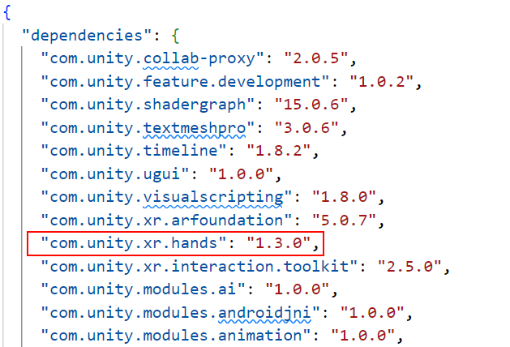

# Edit the project manifest

You can edit the [project manifest](https://docs.unity3d.com/Manual/upm-manifestPrj.html) to add the XR Hands package to your project. The project manifest identifies which packages Unity should use for the project.

> [!TIP]
> XR Hands 1.3 is compatible with Unity Editor versions 2021.3 and newer, but if it does not appear in the Package Manager window we recommend updating to the latest patch version of the Unity Editor. If you do not wish to update, you can follow the steps below to manually edit your project manifest file:

1. In the **Project** window, right-click on **Packages** and choose the **Show in Explorer** (Windows) or **Show in Finder** (Mac) option.

2. Open `Packages/manifest.json` in a text editor.

3. Under "dependencies", add:

   `"com.unity.xr.hands": "1.3.0"`

	 *A typical manifest with the XR Hands package version 1.3.0 added*

   All edits must use correct JSON syntax.

4. Save your changes.

> [!NOTE] 
> If the Editor is open, Unity imports your chosen version of XR Hands when the Editor regains focus. Otherwise, Unity imports packages when you open the project.

See [Package states and lifecycle](xref:upm-lifecycle) for more information about how Unity manages packages.