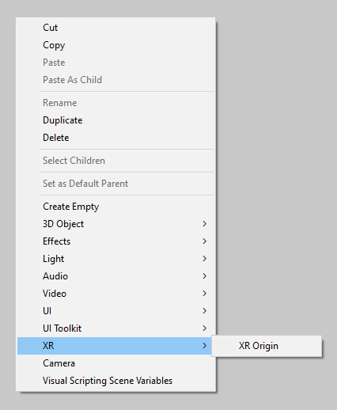
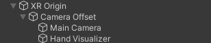

# Scene setup

For a demonstration of how to set up your scene, import the "HandVisualizer" sample from the Package Manager window.

 *Import the HandVisualizer sample*

There is one necessary GameObject to have in each hand-tracking XR scene in your app: an **XR Origin**.

The XR Origin GameObject enables device tracking and transforms trackables into Unity's coordinate system. If this GameObject is not present in the scene, XR will not function properly.

To create an XR Origin, right-click in the Hierarchy window, and select the following option from the context menu.
* **XR** &gt; **XR Origin**

 *Create XR Origin*

After adding an XR Origin to the scene, the Hierarchy window will look like the one below - note that the one below also has a "Hand Visualizer" object, as this was taken from the HandVisualizer sample. XR Origin has a child GameObject named "Camera Offset", and Camera Offset has a child GameObject named "Main Camera". If you're using the sample script or something similar, it should be attached to a child object of the Camera Offset object.

 *Scene graph containing XR Origin*

This is the default scene setup, but you can rename or reparent the GameObjects according to your project needs.

To enable hand-tracking on top of this, you need to enable it in the build settings for your target platform, and have a component similar to the `HandVisualizer` component in the sample attached to a child object of the "Camera Offset" GameObject.
